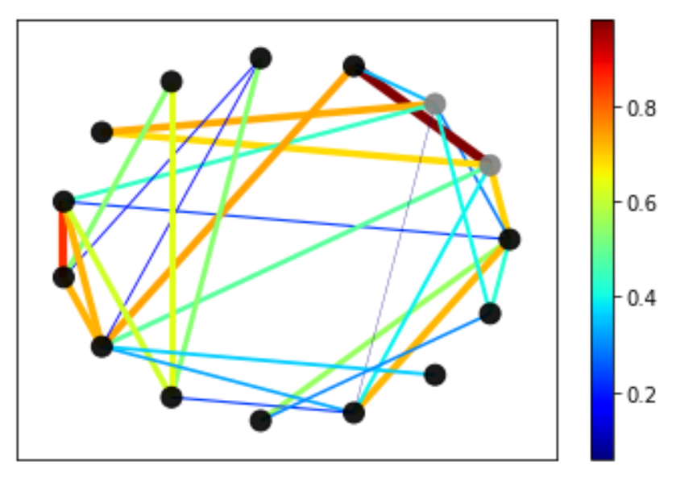

```{r setup, include=FALSE}
knitr::opts_chunk$set(echo = FALSE)
```
# Abstract

Data often has an underlying structure of geometry that can be modeled a signal on the vertices of a weighted, undirected graph. There are several analogies between traditional signal processing an algebraic graph theory that translates many of the tools of discrete signal processing such as spectral analysis of multichannel signals, system transfer function, and digital filter design to name a few. Historically, graph signal processing has focused on modeling smooth signals on a graph, but the increase in availability of abstract data sets has motivated algorithms for learning a valid graph given a set of signals. In this work we design a novel methodology for learning a valid graph topology given a set of binary signals on the graph. This is accomplished by extending the ideas of conditional logistic regression and maximum likelihood with constraints that enforce a valid graph topology.


# Introduction

Data often has  an underlying structure or geometry that can be modeled as a signal on the vertices of a weighted, undirected graph. Traditionally, the emphasis was on using a underlying graph, or network, to understand the properties of signals over the vertices. Recently, there has been a surge in converse problem; of learning a graph structure from a set of signals satisfying some constraints [@xia2021graph] [@dong2016learning] [ @ortega2018graph]. In previous research [@dong2016learning], [@tugnait2021sparse], [@pu2021learning], and [@saboksayr2021accelerated], signals on graph were assumed to follow multivariate gaussian distributions, but there has been little exploration in learning a network from binomial signals. In this work, we develop a noval methodology that allows for learning graph topology given a set of binary signals on the graph. An example of such signals on graph is presented in Figure 1.

{width=90%}

# Methods

#### Signals on the graph and model specification
We consider a weighted undirected graph $G = (V, E)$, with the vertices set $V = {1, 2, \dots, N}$, and edge set $E$.  Let $\mathbf{A}$ denote the weighted adjacency matrix for the graph $G$. In the case of weighted undirected graph, $\mathbf{A}$ is a square and symmetric matrix. 

Let $Y_{i,j}$ denote the signal on the node $i$ of graph $G$ at round $j$, where $j = 1, \dots, M$, and $i = 1, \dots, N$. We assume that $Y_{i,j}$ is a binary signal that can be 1, or 0. 


Suppose the signals at stratum $j$ denoted by $Y[, j]$ for all $N$ nodes are independent of the signals at stratum $k$ denoted by $Y[,k ]$, for $j \neq k$. Let $p_{i,j}$ denote the probability of $Y_{i,j} = 1$. Our model assumes

\begin{equation}
\label{eq: binaryglm}
\text{logit}(p_{i,j}) = \alpha_j + (\mathbf{A} h )_i,
\end{equation}

where $\mathbf{A}$ is the adjacency matrix from the graph $G$, $h$ is a vector of latent factors that governs $p_{i, j}$ through $\mathbf{A}$ and assumed to be a standard normal random vector, and $\alpha_j$ is a round specific parameter at stratum $j$, and assumed to be normally distributed with mean of 0, and unknown variance $\sigma^2$. 

#### Method of Estimation
#####  Conditional likelihood for one stratum
Let $O_j$ denote the set of nodes at stratum $j$ that have observed signals of 1, and let $Z_j$ denote the set of nodes at stratum $j$ that have observed signals of 0. Suppose the number of nodes that have signals of 1 at stratum $j$ is $k_j$. The conditional likelihood function based on model (\ref{eq:binaryglm}) for stratum $j$ of size $N$, is

\begin{equation}
	\label{eq:stratumlikelihood}
	\begin{aligned}
	&	P(Y_{lj} = 1 \text{ for } l \in O_j, Y_{mj} = 0 \text{ for } m \in Z_j | \sum_{i=1}^N Y_{ij} = k_j) \\   
	& =  {\text{exp} (\sum_{l \in O_j}\mathbf{A}[l, ] h ) \over \sum_{J \in C_{k_j}^N} \text{exp} (\sum_{a \in J}\mathbf{A}[a, ] h ) },
	\end{aligned}
\end{equation}

where $C_{k_j}^N$ is the set of all subsets of size $k_j$ of the set ${1, 2, \dots, N}$.
This package uses the same workflow approach as the R Markdown you know and love. Basically it goes from RMarkdown > Knitr > Markdown > Pandoc > HTML/CSS > PDF. You can even use the bibliography the same way [].

# Results

Usually you want to have a nice table displaying some important results that you have calculated. In `posterdown` this is as easy as using the `kable` table formatting you are probably use to as per typical R Markdown formatting.

You can reference tables like so: Table \@ref(tab:mytable). Lorem ipsum dolor sit amet, consectetur adipiscing elit. Aliquam placerat augue at velit tincidunt semper. Donec elementum porta posuere. Nullam interdum, odio at tincidunt feugiat, turpis nisi blandit eros, eu posuere risus felis non quam. Nam eget lorem odio. Duis et aliquet orci. Phasellus nec viverra est.

```{r mytable, out.width='80%'}
knitr::kable(iris[1:10, 1:4], caption = 'Table caption.',align = 'c',"html")
```

Or with figures: Figure \@ref(fig:standard-plot), or Figure \@ref(fig:morefigs).

```{r standard-plot, out.width='80%', fig.align='center', fig.cap='Great figure!', fig.height=5}
plot(mtcars[1:2])
```

```{r morefigs, out.width='80%', echo=TRUE, fig.cap='Amazing, right?!', fig.height=5}
data <- iris

plot(x = data$Sepal.Length, 
     y = data$Sepal.Width, 
     col = data$Species,
     pch = 19, 
     xlab = "Sepal Length (cm)",
     ylab = "Sepal Width (cm)")

```

# Next Steps

Aliquam sed faucibus risus, quis efficitur erat. Vestibulum semper mauris quis tempus eleifend. Aliquam sagittis dictum ipsum, quis viverra ligula eleifend ut. Curabitur sagittis vitae arcu eget faucibus. In non elementum felis. Duis et aliquam nunc. Nunc pulvinar sapien nunc, vel pretium nisi efficitur in. Fusce fringilla maximus leo et maximus. Fusce at ligula laoreet, iaculis mi at, auctor odio. Praesent sed elementum justo. Aenean consectetur risus rhoncus tincidunt efficitur. Praesent dictum mauris at diam maximus maximus [].

# Conclusion

Try `posterdown` out! Hopefully you like it!

```{r, include=FALSE}
knitr::write_bib(c('knitr','rmarkdown','posterdown','pagedown'), 'packages.bib')
```

# References
